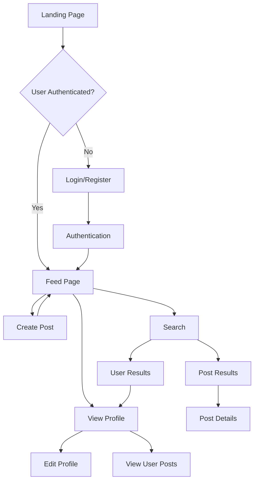

# ConnectSphere - Social Media Platform
## COMP 229 Project Presentation

---

## Slide 1: Title Slide

# ConnectSphere
### A Modern Social Media Platform

**COMP 229 - Web Application Development**

**Team Members:** [Your Name/Team]

**Date:** [Presentation Date]

---

## Slide 2: Project Overview

# Site Overview

**ConnectSphere** is a full-stack social media platform that enables users to:

- ✨ Create and share posts with text and images
- 👥 Connect with other users and view profiles
- ❤️ Engage through likes and dislikes
- 🔍 Search for users and content
- 📱 Access via responsive web interface

**Key Features:**
- User authentication and profiles
- Real-time post feed
- Interactive engagement system
- Advanced search functionality
- Mobile-responsive design

---

## Slide 3: Technology Stack

# Technology Stack

### Frontend
- **React** - UI framework
- **React Router** - Navigation
- **Axios** - API communication
- **Tailwind CSS** - Styling
- **Vite** - Build tool

### Backend
- **Node.js** - Runtime environment
- **Express.js** - Web framework
- **MongoDB** - Database
- **Mongoose** - ODM
- **JWT** - Authentication
- **bcrypt** - Password hashing

### Deployment
- **Vercel** - Frontend hosting
- **MongoDB Atlas** - Cloud database

---

## Slide 4: System Architecture

# System Architecture

```
┌─────────────────────────────────────────────────────────┐
│                    CLIENT (React)                        │
│  ┌──────────┐  ┌──────────┐  ┌──────────┐              │
│  │   Feed   │  │  Profile │  │  Search  │              │
│  └──────────┘  └──────────┘  └──────────┘              │
│                                                          │
│  ┌──────────┐  ┌──────────┐  ┌──────────┐              │
│  │  Create  │  │   Login  │  │ Register │              │
│  └──────────┘  └──────────┘  └──────────┘              │
└─────────────────────────────────────────────────────────┘
                        │
                        │ HTTP/REST API
                        │
┌─────────────────────────────────────────────────────────┐
│              SERVER (Node.js/Express)                   │
│  ┌──────────────┐  ┌──────────────┐                    │
│  │ Auth Routes  │  │ Post Routes  │                    │
│  └──────────────┘  └──────────────┘                    │
│  ┌──────────────┐  ┌──────────────┐                    │
│  │Search Routes │  │   Middleware │                    │
│  └──────────────┘  └──────────────┘                    │
└─────────────────────────────────────────────────────────┘
                        │
                        │ Mongoose ODM
                        │
┌─────────────────────────────────────────────────────────┐
│            DATABASE (MongoDB Atlas)                     │
│  ┌──────────────┐  ┌──────────────┐                    │
│  │    Users     │  │    Posts      │                    │
│  └──────────────┘  └──────────────┘                    │
└─────────────────────────────────────────────────────────┘
```

---

## Slide 5: Database Schema

# Database Schema

## User Model
```javascript
{
  name: String (required),
  email: String (required, unique),
  password: String (hashed),
  profilePic: String,
  bio: String,
  createdAt: Date,
  updatedAt: Date
}
```

## Post Model
```javascript
{
  userId: ObjectId (ref: User),
  content: String (required),
  image: String,
  likes: [ObjectId] (ref: User),
  dislikes: [ObjectId] (ref: User),
  createdAt: Date,
  updatedAt: Date
}
```

**Relationships:**
- User → Posts (One-to-Many)
- Post → Users (Many-to-Many for likes/dislikes)

---

## Slide 6: User Flow Diagram

# User Flow



---

## Slide 7: Key Features - Authentication

# Feature 1: User Authentication

**Secure Authentication System**

- ✅ User Registration with validation
- ✅ Login with JWT tokens
- ✅ Protected routes
- ✅ Session management
- ✅ Password hashing with bcrypt

**Security Features:**
- Passwords are never stored in plain text
- JWT tokens for stateless authentication
- Protected API endpoints
- CORS configuration

---

## Slide 8: Key Features - Posts

# Feature 2: Post Management

**Create, Read, Update, Delete Posts**

- ✅ Create posts with text and images
- ✅ View all posts in chronological feed
- ✅ Edit your own posts
- ✅ Delete your own posts
- ✅ Image URL support

**Engagement:**
- Like/Dislike system
- Real-time like counts
- User interaction tracking

---

## Slide 9: Key Features - Profiles

# Feature 3: User Profiles

**Comprehensive Profile System**

- ✅ View any user's profile
- ✅ Profile pictures and bios
- ✅ View user's posts
- ✅ Edit own profile
- ✅ Profile page with user information

**Profile Features:**
- Customizable profile picture
- Bio section
- Post history
- User statistics

---

## Slide 10: Key Features - Search

# Feature 4: Search Functionality

**Advanced Search Capabilities**

- ✅ Search users by name or email
- ✅ Search posts by content
- ✅ Real-time search results
- ✅ Tabbed interface (All/Users/Posts)
- ✅ Debounced search for performance

**Search Features:**
- Case-insensitive matching
- Instant results
- User cards with quick navigation
- Post previews with full content

---

## Slide 11: UI/UX Design

# Design Philosophy

**Clean & Modern Interface**

- 🎨 Cream/White color scheme (#E8F1F8, #2B3A67)
- 📱 Fully responsive design
- ♿ Accessible components
- 🎯 Intuitive navigation
- ⚡ Smooth transitions and animations

**Design Principles:**
- Minimalist approach
- Consistent spacing
- Clear typography hierarchy
- Hover states and feedback
- Loading indicators

---

## Slide 12: Homepage Screenshot

# Homepage / Feed Page

**[SCREENSHOT PLACEHOLDER]**

**Feed Page Features:**
- Chronological post feed
- User avatars and names
- Post content and images
- Like/Dislike buttons
- Create post button
- Responsive layout

---

## Slide 13: Profile Page Screenshot

# User Profile Page

**[SCREENSHOT PLACEHOLDER]**

**Profile Page Features:**
- User information display
- Profile picture
- Bio section
- User's posts list
- Edit profile button (own profile)
- Navigation to other profiles

---

## Slide 14: Search Page Screenshot

# Search Page

**[SCREENSHOT PLACEHOLDER]**

**Search Page Features:**
- Search input with icon
- Tab navigation (All/Users/Posts)
- User result cards
- Post result cards
- Real-time search
- Empty states

---

## Slide 15: Create Post Page Screenshot

# Create Post Page

**[SCREENSHOT PLACEHOLDER]**

**Create Post Features:**
- Text content input
- Image URL input
- Image preview
- Form validation
- Loading states
- Success/error handling

---

## Slide 16: Mobile Responsive Design

# Mobile Experience

**[SCREENSHOT PLACEHOLDER - Mobile View]**

**Mobile Features:**
- Hamburger menu navigation
- Touch-friendly buttons
- Responsive layouts
- Mobile-optimized forms
- Profile dropdown menu
- Swipe-friendly interface

---

## Slide 17: API Endpoints

# RESTful API Structure

**Authentication:**
- `POST /api/register` - User registration
- `POST /api/login` - User login
- `POST /api/logout` - User logout

**Users:**
- `GET /api/users/:id` - Get user profile
- `PUT /api/users/:id` - Update profile

**Posts:**
- `GET /api/post` - Get all posts
- `POST /api/post` - Create post
- `PUT /api/post/:id` - Update post
- `DELETE /api/post/:id` - Delete post
- `POST /api/post/:id/like` - Like post
- `POST /api/post/:id/dislike` - Dislike post

**Search:**
- `GET /api/search` - Search all
- `GET /api/search/users` - Search users
- `GET /api/search/posts` - Search posts

---

## Slide 18: Security Features

# Security Implementation

**Authentication & Authorization:**
- JWT token-based authentication
- Password hashing with bcrypt (10 salt rounds)
- Protected routes middleware
- Token expiration (1 day)

**API Security:**
- CORS configuration
- Input validation
- SQL injection prevention (NoSQL)
- XSS protection
- Rate limiting ready

**Data Protection:**
- Passwords never exposed
- Secure token storage
- Environment variables for secrets

---

## Slide 19: Performance Optimizations

# Performance Features

**Frontend Optimizations:**
- Debounced search (300ms)
- Lazy loading ready
- Optimized re-renders
- Efficient state management

**Backend Optimizations:**
- Database indexing
- Query optimization
- Pagination ready
- Efficient data population

**Network:**
- RESTful API design
- Minimal API calls
- Efficient data transfer
- Error handling

---

## Slide 20: Testing & Quality Assurance

# Testing Strategy

**Manual Testing:**
- ✅ User registration flow
- ✅ Login/logout functionality
- ✅ Post creation and editing
- ✅ Profile management
- ✅ Search functionality
- ✅ Mobile responsiveness

**Quality Checks:**
- Form validation
- Error handling
- Loading states
- Edge cases
- Cross-browser compatibility

---

## Slide 21: Challenges & Solutions

# Challenges Overcome

**Challenge 1: CORS Issues**
- **Solution:** Configured CORS middleware with specific origins

**Challenge 2: Port Conflicts**
- **Solution:** Changed port from 5000 to 5001 (macOS AirPlay conflict)

**Challenge 3: Database Connection**
- **Solution:** Added explicit database name to connection string

**Challenge 4: Mobile Navigation**
- **Solution:** Implemented separate state management for mobile/desktop menus

**Challenge 5: Real-time Search**
- **Solution:** Implemented debouncing to reduce API calls

---

## Slide 22: Future Enhancements

# Future Roadmap

**Planned Features:**
- 📸 Image upload (currently URL-based)
- 💬 Comments system
- 🔔 Notifications
- 📊 Analytics dashboard
- 🌐 Social sharing
- 📱 Progressive Web App (PWA)
- 🔐 Two-factor authentication
- 📈 Post analytics

**Technical Improvements:**
- Unit and integration tests
- CI/CD pipeline
- Performance monitoring
- Advanced caching
- Real-time updates (WebSockets)

---

## Slide 23: Project Statistics

# Project Statistics

**Code Metrics:**
- **Frontend:** ~15+ React components
- **Backend:** 4 route files, 4 controllers
- **Database:** 2 models (User, Post)
- **API Endpoints:** 15+ endpoints
- **Pages:** 7 main pages

**Features:**
- ✅ User authentication
- ✅ Post management
- ✅ Profile system
- ✅ Search functionality
- ✅ Like/Dislike system
- ✅ Responsive design

**Demo Data:**
- 5 demo users
- 20 sample posts
- Realistic content

---

## Slide 24: Lessons Learned

# Key Learnings

**Technical Skills:**
- Full-stack development
- RESTful API design
- Database modeling
- Authentication systems
- Responsive design

**Best Practices:**
- Code organization
- Error handling
- Security considerations
- User experience design
- Version control (Git)

**Challenges:**
- CORS configuration
- State management
- Database relationships
- Mobile responsiveness

---

## Slide 25: Conclusion

# Thank You!

## ConnectSphere
### A Modern Social Media Platform

**Key Achievements:**
- ✅ Fully functional social media platform
- ✅ Secure authentication system
- ✅ Responsive design
- ✅ Search functionality
- ✅ Clean, modern UI

**Questions?**

**GitHub Repository:** [Your Repo URL]
**Live Demo:** [Your Demo URL]

---

## Appendix: Component Structure

# Frontend Component Hierarchy

```
App.jsx
├── Navigation
│   ├── Desktop Menu
│   ├── Mobile Menu
│   └── User Dropdown
├── Routes
│   ├── Login
│   ├── Register
│   ├── Feed
│   ├── CreatePost
│   ├── EditPost
│   ├── Profile
│   ├── EditProfile
│   └── Search
└── Components
    ├── PostCard
    ├── ProtectedRoute
    └── LoadingSpinner
```

---

## Appendix: Database Relationships

# Entity Relationship Diagram

```
┌─────────────┐         ┌─────────────┐
│    USER     │         │    POST     │
├─────────────┤         ├─────────────┤
│ _id         │◄──┐     │ _id         │
│ name        │   │     │ userId      │──┐
│ email       │   │     │ content     │  │
│ password    │   │     │ image       │  │
│ profilePic  │   │     │ likes[]     │──┼──┐
│ bio         │   │     │ dislikes[]  │──┼──┼──┐
└─────────────┘   │     └─────────────┘  │  │  │
                  │                     │  │  │
                  └─────────────────────┘  │  │
                                           │  │
                    ┌──────────────────────┘  │
                    │                         │
                    └─────────────────────────┘

One User → Many Posts
Many Users → Many Posts (likes/dislikes)
```

